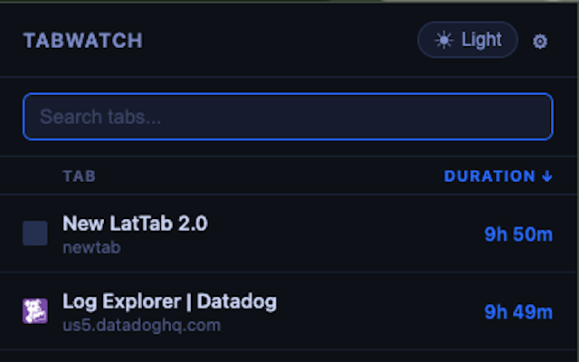
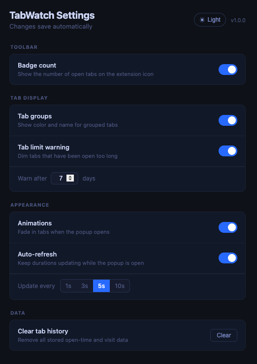

# TabWatch

> See how long every browser tab has been open — search, sort, jump to or close any tab without leaving the popup.

---

## Features

### Core

- **Time per tab** — tracks how long each tab has been open, persisted across browser sessions
- **Sort by duration or title** — click column headers to toggle sort direction (↑ ↓)
- **Search** — filter tabs by title or URL instantly
- **Jump to tab** — click any row to focus that tab and window, closing the popup
- **Close tab** — hover a row to reveal an × button; closes the tab without switching to it
- **Visit counter** — tracks how many times you've activated each tab; persists even after the tab is closed and reopened
- **Dark / light mode** — toggle in the toolbar or settings, preference saved automatically



### Settings

All configurable via the ⚙ settings page:

- **Badge count** — shows the number of open tabs on the extension icon
- **Tab groups** — displays each tab's Chrome group name and color as a pill
- **Tab limit warning** — dims tabs open longer than a configurable threshold (default 7 days)
- **Auto-refresh** — keeps durations updating live while the popup is open; interval: 1s / 3s / 5s / 10s
- **Animations** — subtle fade-in cascade when the popup opens
- **Clear tab history** — wipe all stored open-time and visit data



### Keyboard shortcuts

| Key       | Action                                                |
| --------- | ----------------------------------------------------- |
| `↓` / `↑` | Move focus through the tab list                       |
| `Enter`   | Jump to the focused tab                               |
| `Escape`  | Close the popup                                       |
| `1` – `5` | Jump directly to that row (only when search is empty) |

---

## Install

### Chrome Web Store

[Install from the Chrome Web Store](https://chromewebstore.google.com/detail/pgjiceamhhcdccdoaiggbfjmmllbhmah)

### Firefox Add-ons

[Install from Firefox Add-ons](https://addons.mozilla.org/en-US/firefox/addon/tabwatch/)

### Load from source

1. Clone the repo:
   ```bash
   git clone https://github.com/shadoath/tab-watch.git
   ```
2. Open Chrome and go to `chrome://extensions`
3. Enable **Developer mode** (toggle in the top-right)
4. Click **Load unpacked** and select the `tab-watch` folder

---

## How it works

- A background service worker listens for `tabs.onUpdated` events. When a page finishes loading it stores `tabId + URL → timestamp` in `chrome.storage.local`.
- Visit counts are stored by URL so they survive a tab being closed and reopened.
- When you open the popup, it reads all open tabs, fetches stored timestamps, and calculates elapsed time.
- Navigating to a new URL in a tab resets that tab's timer. Refreshing the same page does not.
- The auto-refresh ticker updates duration text in-place (no DOM rebuild) to avoid flicker.
- Stale timestamp keys for tabs that no longer exist are cleaned up on browser startup.

All data is stored locally in your browser. Nothing is ever sent anywhere.

---

## Permissions

| Permission  | Why                                             |
| ----------- | ----------------------------------------------- |
| `tabs`      | Read tab titles, URLs, favicons, and close tabs |
| `storage`   | Persist timestamps and preferences locally      |
| `windows`   | Focus the correct window when jumping to a tab  |
| `tabGroups` | Read Chrome tab group names and colors          |

---

## Why this exists

I built this because I'm a habitual tab hoarder — tabs I open with the intention of reading, acting on, or coming back to just... sit there. Days turn into weeks. TabWatch makes the problem visible: when you can see that a tab has been open for 42 days, it's a lot harder to ignore. The tab limit warning dims the worst offenders so they stand out immediately. Open it, deal with it, close it.

---

## License

[MIT](LICENSE)
